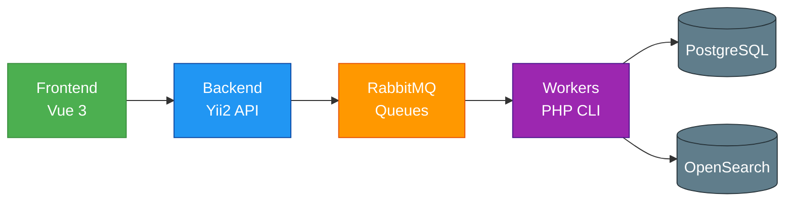

#  High-Load Product Import & Sync System

Высоконагруженная система импорта и синхронизации товаров от сотен тысяч продавцов. Обрабатывает миллионы строк в CSV-файлах, обеспечивает дедупликацию, нормализацию, индексацию и хранение в PostgreSQL + OpenSearch.

---

##  Ключевые возможности

- 📥 Импорт и обработка **миллионов строк** из CSV-фидов
- 🔁 **Дедупликация** товаров через `match_key`, GTIN, variant_hash
- 🧹 **Нормализация** данных: бренды, названия, гарантия, цвета и др.
- ⚡ **Асинхронная обработка** через RabbitMQ (парсинг → обработка → индексация)
- 🔍 Полноценный **поиск** через OpenSearch с фильтрацией по атрибутам
- 🖼️ **Обработка изображений** через Imaginary (resize/fit/crop) + MinIO
- 📊 Отчётность: ошибки импорта сохраняются в CSV для каждого продавца
- Метрики:общее время обработки фида ,время процессинга в БД,Opensearch
- ✅ **Покрытие юнит-тестами** основных сервисов (Codeception + mocks)

---

## 🧩 Технологический стек

| Компонент          | Технология                          |
|--------------------|-------------------------------------|
| **Backend**        | PHP 8.2+, Yii2 (Advanced Template)  |
| **Frontend**       | Vue 3 + Vite                        |
| **База данных**    | PostgreSQL 16                       |
| **Поиск**          | OpenSearch                          |
| **Очереди**        | RabbitMQ                            |
| **Кэш / Сессии**   | Redis                               |
| **Хранение медиа** | MinIO (S3-compatible)               |
| **Обработка изображений** | Imaginary (libvips)         |
| **Контейнеризация**| Docker + docker-compose             |

---

## ⚙️ Запуск проекта (локальная разработка)

### Требования
- Docker 24+
- Docker Compose v2+
- RAM ≥ 16 ГБ (рекомендуется 32 ГБ)
- Windows (рекомендуется WSL2)

### Шаги

```bash
# 1. Клонировать репозиторий
git clone <repo-url>
cd <repo-dir>

# 2. Собрать и запустить контейнеры
docker-compose up -d

# 3. Установить зависимости PHP
docker exec -it yii2_php composer install

# 4. Запустить миграции
docker exec -it yii2_php php yii migrate/up --interactive=0


###  Примеры покрытых сценариев

| Сценарий | Описание |
|----------|----------|
| `testImportChunkSuccess` | Успешный импорт чанка данных |
| `testImportChunkCategoryNotFound` | Обработка ошибки: категория не найдена |
| `testImportChunkFailsOnMissingSkuCode` | Валидация обязательных полей |
| `testImportChunkDeduplicatesIdenticalRows` | Дедупликация одинаковых строк |

### ▶️ Запуск тестов

```bash
# Запуск теста
docker-compose exec php vendor/bin/codecept run unit services/OfferBulkImportServiceTest


### 📊 Архитектура системы
